# 第十周
## 路由重發佈
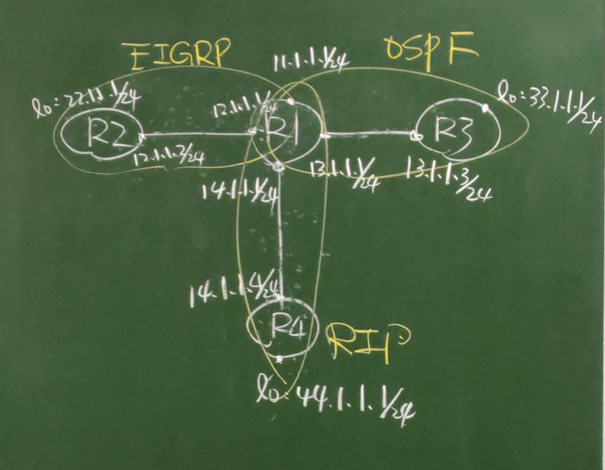            
### 建置如下圖的網路來模擬路由重發佈           
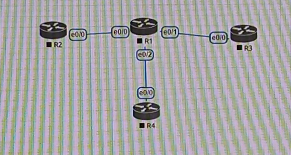          
```
//R1
>en
#conf t
#hostname R1
#int lo0
#ip addr 11.1.1.1 255.255.255.0
#no shut
#int e0/0
#ip addr 12.1.1.1 255.255.255.0
#no shut
#int e0/1
#ip addr 13.1.1.1 255.255.255.0
#no shut
#int e0/2
#ip addr 14.1.1.1 255.255.255.0
#no shut
#do show ip int brief   //確認設定
```
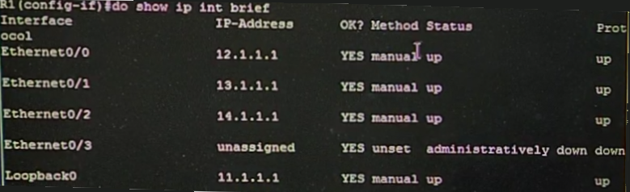         
```
//R2
>en
#conf t
#hostname R2
#int lo0
#ip addr 22.1.1.1 255.255.255.0
#no shut
#int e0/0
#ip addr 12.1.1.2 255.255.255.0
#no shut
#do ping 12.1.1.1   //成功，表示可以與R1做連線
```
```
//R3
>en
#conf t
#hostname R3
#int lo0
#ip addr 33.1.1.1 255.255.255.0
#no shut
#int e0/0
#ip addr 13.1.1.3 255.255.255.0
#no shut
#do ping 13.1.1.1   //成功，表示可以與R1做連線
```
```
//R3
>en
#conf t
#hostname R4
#int lo0
#ip addr 44.1.1.1 255.255.255.0
#no shut
#int e0/0
#ip addr 14.1.1.4 255.255.255.0
#no shut
#do ping 14.1.1.1   //成功，表示可以與R1做連線
```
### 接著設定三個不同路由協定的網路(rip,ospf,eigrp)     
#### eigrp設定     
```
//R2
>en
#conf t
#router eigrp 90
#no auto-summary
#network 12.1.1.0 0.0.0.255
#network 22.1.1.1 0.0.0.0
//R1
>en
#conf t
#router eigrp 90
#no auto-summary
#network 12.1.1.0 0.0.0.255
#do show ip route eigrp     //會有eigrp的設定
#do ping 22.1.1.1       //成功
```
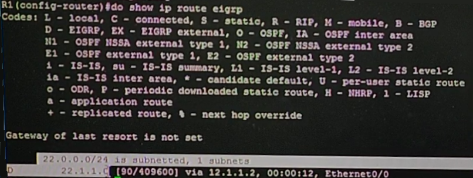       
#### ospf設定     
```
//R3
>en
#conf t
#router ospf 1
#network 13.1.1.0 0.0.0.255 area 0
#network 33.1.1.1 0.0.0.0 area 0
//R1
#router ospf 1
#network 13.1.1.0 0.0.0.255 area 0
#network 11.1.1.1 0.0.0.0 area 0
#do show ip route   //會有ospf的設定
```
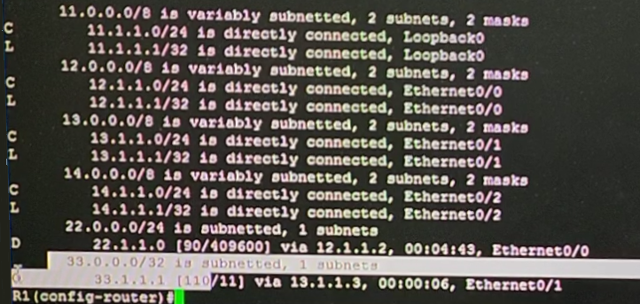       
#### rip設定     
```
//R4
>en
#conf t
#router rip
#version 2
#no auto-summary
#network 14.1.1.4
#network 44.1.1.1
//R1
#router rip
#version 2
#no auto-summary
#network 14.1.1.1
#do show ip route   //會有rip的設定
```
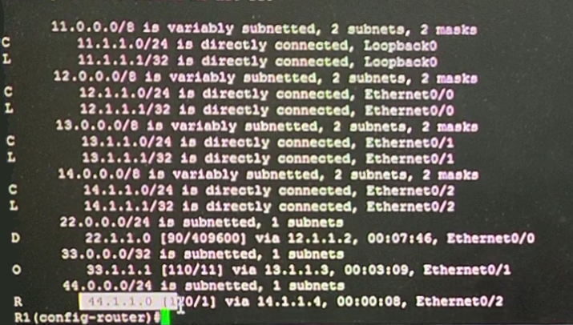        
### 直連設定，重點指令下圖所示     
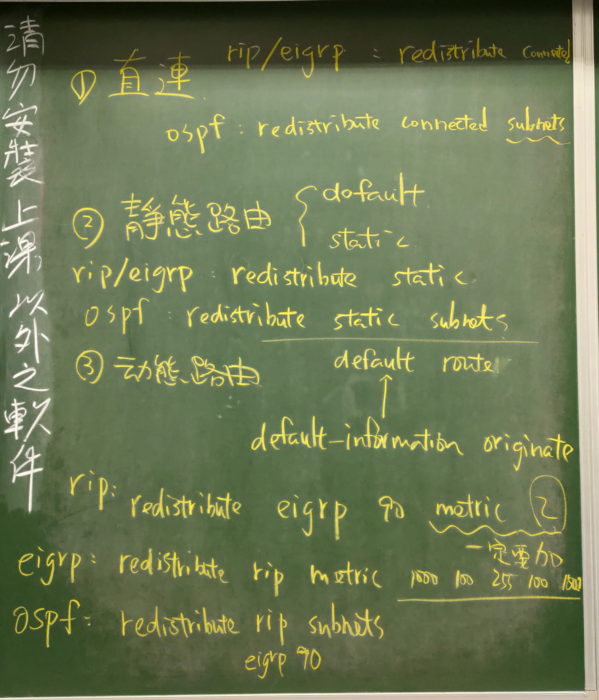         
#### rip設定     
```
//R1
>en
#conf t
#router rip
#redistribute connected
//R4
>en
#show ip route  //會學到三條路由
#ping 13.1.1.1  //成功
#ping 13.1.1.3  //失敗，傳得到R3，但R3上沒傳回的路由 
```
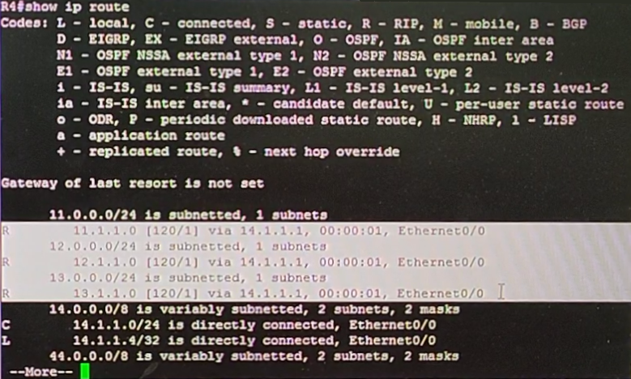        
#### eigrp設定     
```
//R1
#router eigrp 90
#redistribute connected
//R2
>en
#show ip route
#ping 13.1.1.1  //成功
#ping 13.1.1.3  //失敗，傳得到R3，但R3上沒傳回的路由 
#ping 14.1.1.4  //成功，因R4有路由可傳回
```
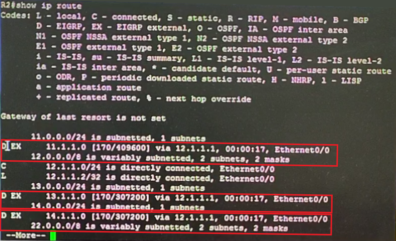     
#### ospf設定     
```
//R1
#router ospf 1
#redistribute connected subnets
//R3
>en
#show ip route
#ping 12.1.1.2  //成功
```
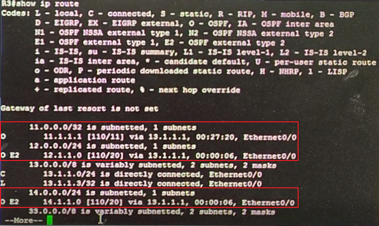  
### 靜態路由設定
#### rip設定     
```
//R1
#ip route 111.1.1.0 255.255.255.0 null 0    //null 0 路由器收到這個封包直接丟棄
#ip route 0.0.0.0 0.0.0.0 null 0    //default路由
#do show ip route   //會增加兩個靜態路由，有星星'*'為default靜態路由
#router rip
#redistribute static
//R4
>en
#show ip route
```
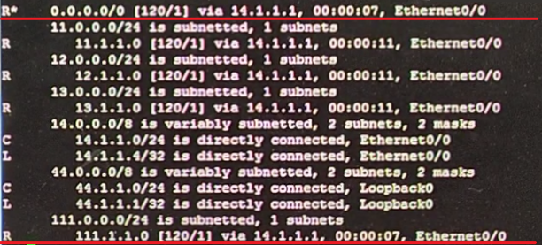     
#### eigrp設定     
```
//R1
#router eigrp 90
#redistribute static
//R2
>en
#show ip route
```
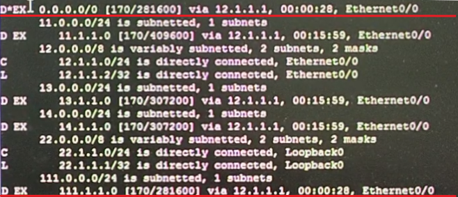     
#### ospf設定     
```
//R1
#router ospf 1
#redistribute static subnets
#default-information originate  //加這行才能讓R3學到default靜態路由
//R3
>en
#show ip route
```
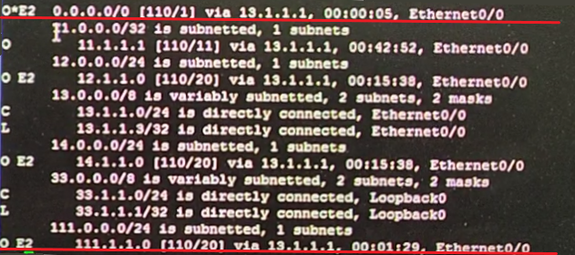     
### 動態路由設定(學習每台路由的loopback)，此處要加metric要不然會被判讀metric無限大，最後學不到路由     
#### rip設定     
```
//R1
>en
#conf t
#router rip
#redistribute eigrp 90 metric 2
//R4
>en
#show ip route
```
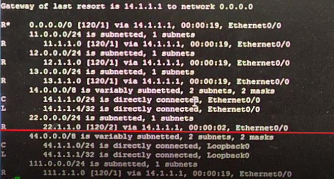        
#### eigrp設定     
```
//R1
#router eigrp 90
#redistribute rip metric 1000 100 255 100 1500  
//頻寬1000,延遲100,可信度255,Loading 100,MTU 1500
//R2
>en
#show ip route
```
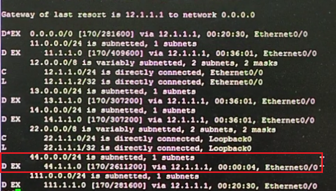  
#### ospf設定(不用設metric會預設為20)     
```
//R1
#router ospf 1
#redistribute rip subnets
#redistribute eigrp 90 subnets
//R3
>en
#show ip route
#ping 44.1.1.1 source 33.1.1.1  //成功，因為重分佈設定完成
```
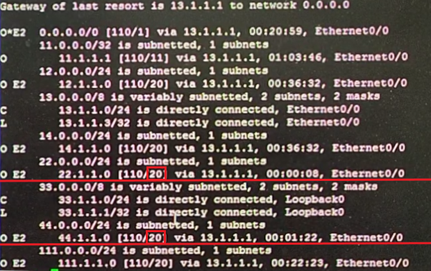     
## VLAN      
### 重點介紹       
      
效能、安全更高。VLAN技術可將不同接口、主機，應用劃分到不同網段，並且不同的VLAN處在不同的廣播域，因此可實現廣播隔離減少泛洪。VLAN具備跨交換機，跨地理位置特性，同一VLAN的設備可處在不同交換機上。              
 - VLAN分類      
    1. 數據VLAN    
    2. 語音VLAN      
    3. 管理VLAN         
    4. 自然(naive)VLAN(不須打標籤)          
    5. 私有VLAN          
 - Cisco交換機VLAN範圍0~4095
    1. 0,4095:系統保留。         
    2. 1:系統默認VLAN，所有接口默認在VLAN1，不能刪除修改。       
    3. 2~1001:乙太網路最常用的VLAN範圍。    
    4. 1002~1005:用於FDDI和token ring。    
    5. 1006~1024:系統保留。       
    6. 1025~4094:拓展的乙太網路VLAN。     
### 簡易實作        
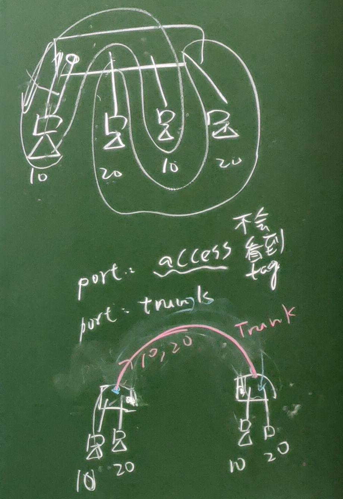      
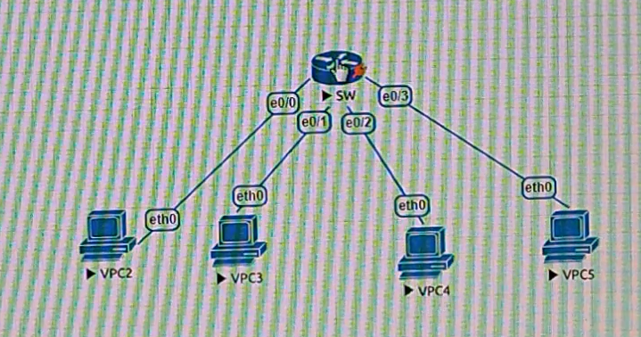      
```
//先把所有VPC架在同一VLAN上
//VPC2
>ip 192.168.1.1
//VPC3
>ip 192.168.1.2
//VPC4
>ip 192.168.1.3
//VPC5
>ip 192.168.1.4
//VPC2
>ping 192.168.1.2   //測試成功
>ping 192.168.1.3   //測試成功
>ping 192.168.1.4   //測試成功
//SW
>en
#conf t
#vlan 10
#vlan 20
#do show vlan 
#vlan 20
#exit
#exit
#show vlan   //查看vlan 10和20 是否建立
#conf t
#int e0/0
#switchport mode access
#switchport access vlan 10
#int e0/1
#switchport mode access
#switchport access vlan 20
#int e0/2
#switchport mode access
#switchport access vlan 10
#int e0/3
#switchport mode access
#switchport access vlan 20
#exit
#exit
#show vlan brief
```
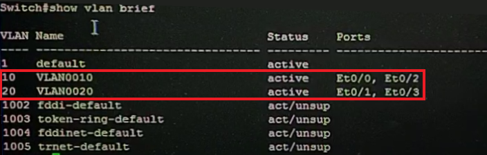      
此時去互PING會發現VLAN要相同標籤的才能PING得到，不相同的PING不到。      