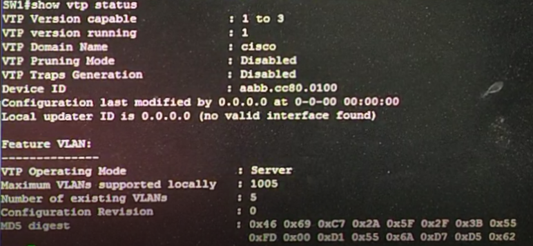

# 第十一周
## 基本Layer2&Layer3的架構

主要分三層Core核心層、Aggregate匯聚層、Access接入層，若再層與層之間的傳遞出現Loop用STP(spanning tree protocol)解決。     
此架構要連到Internet一定要用Router作轉址，Layer3的switch無法做到。    
若資金足夠，會像圖上方多一台Router拿來做VPN用。            
 1. Core核心層：通常做快速轉發用，左方機器通常會接機房做類似校務系統連線用。      
 2. Aggregate匯聚層：路由策略用。      
 3. Access接入層：提供接入用。       
        
## Switch vlan interface(SVI)設定種類
             
上圖為vlan與vlan之間連線的三種方法。        
SVI是Layer3設備，頻寬大主要連switch，用來做vlan與vlan之間連接的trunk。                    
## 簡易vLAN實作         
                     
                     
EVE-NG Layer2 switch兩台，四台virtual PC
```
//VPC3
>ip 192.168.1.1 255.255.255.0
//VPC4
>ip 192.168.1.2 255.255.255.0
//VPC5
>ip 192.168.2.3 255.255.255.0
//VPC6
>ip 192.168.2.4 255.255.255.0
//SW1
>en
#conf t
#hostname SW1
#vlan 10
#name aa
#exit
#vlan 20
#name bb
#do show vlan brief //檢查vlan是否設定成功，沒有就重下指令
#int range e0/0,e0/3
#switchport mode access
#switchport access vlan 10
#exit
#int range e0/1,e0/2
#switchport mode access
#switchport access vlan 20
#do show vlan brief //檢查PORT是否設定成功，沒有就重下指令
//SW2
>en
#conf t
#hostname SW2
#vlan 10
#name aa
#exit
#vlan 20
#name bb
#do show vlan brief //檢查vlan是否設定成功，沒有就重下指令
#int range e0/0,e0/3
#switchport mode access
#switchport access vlan 10
#exit
#int range e0/1,e0/2
#switchport mode access
#switchport access vlan 20
#do show vlan brief //檢查PORT是否設定成功，沒有就重下指令
//VPC3
>ping 192.168.1.2   //成功，因為在相同vlan
>ping 192.168.2.3   //失敗，因為在不相同vlan
```
## 簡易vLAN實作(trunk)         
                     
                     
把剛剛中間兩條線去掉，換成一條連接。
```
//SW2
>en
#conf t
#do show vlan brief  //檢查設定
#int e0/2
#switchport trunk encapsulation dot1q   //指定封裝
#switchport mode trunk
//如果要限定封包傳送加 switchport trunk allowed 10,20(限定vlan標籤10,vlan標籤20通過)
//現在此處可以不用設
//SW1
>en
#conf t
#do show vlan brief  //檢查設定
#int e0/2
#switchport trunk encapsulation dot1q   //指定封裝
#switchport mode trunk
#do show vlan brief     //檢查access port設定
#do show int trunk      //檢查trunk設定，native vlan為1，代表不用標籤也可傳輸，這樣傳輸會較快
//SW2
#do show int trunk      //結果一樣
```
                     
開啟Wireshark觀察封包。            
```
//VPC3
>ping 192.168.1.2   //成功，因為在相同vlan
//VPC5
>ping 192.168.2.4   //成功，因為在相同vlan
```
### Trunk封包型態              
            
VPC3 ping 192.168.1.2，封包第二層表頭會有目的IP、來源IP、Type 802.1Q 8100，接著接802.1Q 共4byte，16bits為12+4bits，4bits為保留，12bits為2^12=4096，ID=10，顯示16進制 00 0a。          
VPC5 ping 192.168.2.4，ID=20，顯示16進制 00 14。          
### 設定成native vlan
```
//SW1
#switchport trunk native vlan 10
//SW2
#switchport trunk native vlan 10
//VPC3
>ping 192.168.1.2   
```
觀察封包發現vlan ID標籤不見了。       
一個系統只有一個native vlan，而SW1和SW2的native vlan設定不一樣會發生斷線。     
## DTP(Dynamic Trunk Protocol)             
                     
是cisco私有技術，用來協商Trunk。
## DTP實作
```
//兩台皆為 nonegotiate
//SW1
>en
#conf t
#int e0/2
#switchport nonegotiate
//SW2
>en
#conf t
#int e0/2
#switchport nonegotiate
//設定完後原本有兩個協定STP和DTP，只剩下STP
//兩台皆為 dynamic desirable
//SW1
#no switchport nonegotiate
#switchport mode dynamic desirable
//SW2
#no switchport nonegotiate
#switchport mode dynamic desirable
//SW1
#do show int trunk //可以看到mode為desirable的trunk
//SW2為 dynamic auto
//SW2
#switchport mode dynamic auto
#do show int trunk //一樣是trunk
//兩台皆為 dynamic auto
//SW1
#switchport mode dynamic auto
#do show int trunk  //不會有trunk資料，因為都變Access
```
## VTP(vLAN Trunk Portocol)         
                     
思科私有技術，用於實現對vLAN的全局管理(創建、刪除、修改)，先有trunk才有VTP。          
     
- 模式：
 1. Server：能創建、刪除、修改vLAN。
 2. Client：不能創建、刪除、修改vLAN，但能學習轉發。
 3. Transparent：能創建、刪除、修改vLAN，不能學習轉發。
       
## VTP實作        
                     
開三台Layer2 switch，SW為Server，SW2,SW3為Client，SW的設定會轉發到SW2,SW3。       
```
//SW
>en
#conf t
#hostname SW1
#vtp domain cisco //cisco為名字，可以自己設定
#vtp password ccna  //ccna為密碼，可以自己設定
#vtp mode server
#exit
#show vtp status    //查看設定，並確認為server
```
  
```
//SW2
>en
#conf t
#hostname SW2
#vtp domain cisco
#vtp password ccna
#vtp mode client
#exit
#show vtp status    //查看設定，並確認為client
//SW3
>en
#conf t
#hostname SW3
#vtp domain cisco
#vtp password ccna
#vtp mode client
#exit
#show vtp status    //查看設定，並確認為client
```
```
//SW,SW2,SW3都做 show vlan brief，狀態都一樣沒設任何vlan
//SW
#vlan 10
#vlan 20
#vlan 30
#do show vlan brief     //檢查vlan是否設定成功，沒有就重下指令
#int e0/0
#switchport trunk encapsulation dot1q
#switchport mode trunk
//SW2
#conf t
#int e0/0
#switchport trunk encapsulation dot1q
#switchport mode trunk
#int e0/1
#switchport trunk encapsulation dot1q
#switchport mode trunk
//SW3
#conf t
#int e0/0
#switchport trunk encapsulation dot1q
#switchport mode trunk
//SW2
#exit
#exit
#show vlan brief   
//SW3
#exit
#exit
#show vlan brief   
//會發現SW2,SW3同步SW，有vlan 10,20,30
//SW
#no vlan 30
#do show vlan brief //除掉vlan 30
//SW2
#show vlan brief 
//SW3
#show vlan brief 
//會發現SW2,SW3同步SW，有vlan 10,20，vlan 30被除掉
//SW2
#conf t
#vlan 100
//會有提示說client不能創vlan
```