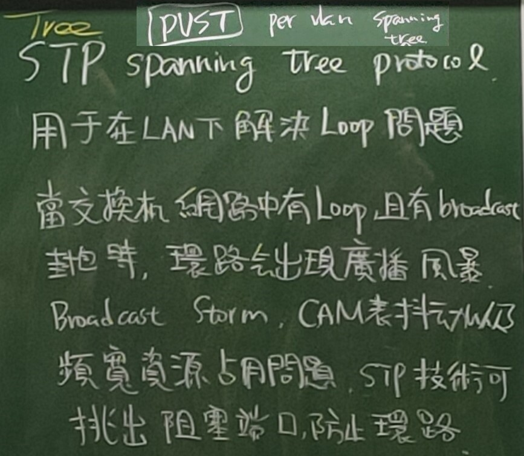

# 第十二周
## vLAN小試身手(本周switch都是用layer2的)        
### 建立下圖vLAN的架構，VPC1和VPC2可否互ping呢?         
       
```
//VPC1
>ip 192.168.10.1 255.255.255.0
//VPC2
>ip 192.168.10.2 255.255.255.0
//SW3
>en
#conf t
#hostname SW1
#int e0/0
#switchport mode access
#switchport access vlan 10
#int e0/1
#switchport mode access
#switchport access vlan 10
#exit
#no cdp advertise-v2    //因為cisco version2裡會多個native vlan的欄位，所以沒設定native vlan會出現dismatch而無法連線，所以要正常連線要下這行指令，而此問題只有兩台cisco連線時會出現。
//SW4
>en
#conf t
#hostname SW2
#int e0/0
#switchport mode access
#switchport access vlan 20
#int e0/1
#switchport mode access
#switchport access vlan 20
#exit
#no cdp advertise-v2
//VPC1
>ping 192.168.10.2  //成功
//VPC2
>ping 192.168.10.1  //成功，所以可以達成互ping的效果
```
### 建立下圖vLAN的架構，VPC1和VPC2可否互ping呢?      
           
```
//VPC1
>ip 192.168.10.1 255.255.255.0  //上一個範例延用可以不用設
//VPC2
>ip 192.168.10.2 255.255.255.0  //上一個範例延用可以不用設
//SW1
#default int range e0/0-1   //延用剛剛的機器，並把所有狀態還原成預設
#int e0/0
#switchport trunk encapsulation dot1q
#switchport mode trunk
#switchport trunk native vlan 10
#int e0/1
#switchport trunk encapsulation dot1q
#switchport mode trunk
#switchport trunk native vlan 20
//SW2
#default int range e0/0-1   //延用剛剛的機器，並把所有狀態還原成預設
#int e0/0
#switchport mode access
#switchport access vlan 10
#int e0/1
#switchport trunk encapsulation dot1q
#switchport mode trunk
#switchport trunk native vlan 30
//VPC1
>ping 192.168.10.2  //成功
//VPC2
>ping 192.168.10.1  //成功，所以可以達成互ping的效果
```
### VTP修改只能在server模式下進行，client則無法修改，而同步主要看Configuration Revision的版本，以版本大的拿來同步。
           
建兩台layer2的switch，用Trunk相連。
```
//SW1
>en
#conf t
#hostname SW1
#int e0/0
#switchport trunk encapsulation dot1q
#switchport mode trunk
#vtp domain cisco       //此時預設vtp mode為server
//SW2
>en
#conf t
#hostname SW2
#int e0/0
#switchport trunk encapsulation dot1q
#switchport mode trunk
#vtp domain cisco 
#vtp mode client
//SW1
#exit
#exit
#conf t
#do show vlan brief     //此時vlan還未設定
#do show vtp status     //上半部可以看到剛剛設的vtp domain name為cisco，下半部要注意Configuration Revision，現在沒設vlan所以值為0
#vlan 10
#do show vlan brief     //查看有沒有設定成功，沒有再下vlan 10指令
#do show vtp status     //可以看到Configuration Revision的值為1
#vlan 20
#do show vlan brief     //查看有沒有設定成功，沒有再下vlan 20指令
#vlan 30
#do show vlan brief     //查看有沒有設定成功，沒有再下vlan 30指令
#do show vtp status     //可以看到Configuration Revision的值為3
//SW2
#do show vlan brief     //可以看到SW1設定的vlan 10,vlan 20,vlan 30同步過來
#do show vtp status     //可以看到Configuration Revision的值也為3
#int e0/0
#shut       //先斷連線，暫時不同步
#vtp mode server    //更改模式，修改vlan設定
#no vlan 10
#no vlan 20
#no vlan 30
#do show vtp status     //可以看到Configuration Revision的值為6
#vlan 40
#do show vlan brief     //查看有沒有設定成功，沒有再下vlan 40指令
#do show vtp status     //可以看到Configuration Revision的值為7
#vlan 50
#do show vlan brief     //查看有沒有設定成功，沒有再下vlan 50指令
#do show vtp status     //可以看到Configuration Revision的值為8
#vlan 60
#do show vlan brief     //查看有沒有設定成功，沒有再下vlan 60指令，此時vlan變成只有vlan 40,vlan 50,vlan 60
#vtp mode client        //改回客戶模式
#do show vtp status     //可以看到Configuration Revision的值為9，且vtp mode改回成client
#int e0/0
//SW1
#do show vtp status     //可以看到Configuration Revision的值為3，因為沒連線沒同步，所以SW1還是原來的設定，vtp mode為server
#do show vlan brief     //可以看到設定還是vlan 10,vlan 20,vlan 30
//跟SW2相比vlan不同，vtp mode:SW1為server,SW2為client，Configuration Revision還比SW2小
//SW2
#no shut   //建回連線做同步
#do show vtp status     //可以看到Configuration Revision的值為9，vtp mode為client，沒有改變
#do show vlan brief     //vlan為vlan 40,vlan 50,vlan 60沒改變
//SW1
#do show vtp status     //可以看到Configuration Revision的值變為9
#do show vlan brief     //vlan變為vlan 40,vlan 50,vlan 60
//所以同步主要看Configuration Revision的版本，以版本大的拿來同步，並非看vtp mode，vtp mode只是看此使用模式可否做修改的狀態顯示
```
### VTP Pruning
       
       
啟用的才給予trunk連線，以達到頻寬資源節省(延用上一個設定的SW1,SW2，再加入兩台VPC)
```
//VPC3
>ip 192.168.10.1 255.255.255.0
//VPC4
>ip 192.168.10.2 255.255.255.0
//SW1
>en
#conf t
#int e0/1
#switchport mode access
#switchport access vlan 40
//SW2
>en
#conf t
#int e0/1
#switchport mode access
#switchport access vlan 40
//SW1
#do show int trunk  //vlan允許通過和動態管理domain有1,40,50,60，vlan spanning tree通過狀態和不是pruned的有1,40,50,60
#do show vtp status //VTP Pruning Mode為Disabled
#exit
#vtp pruning    //開啟vtp pruning  
//SW2
#exit
#vtp pruning    //開啟vtp pruning  
//SW1
#do show vtp status //VTP Pruning Mode為Enabled
#do show int trunk  //vlan允許通過和動態管理domain有1,40,50,60，vlan spanning tree通過狀態和不是pruned變只有1,40，因為只有vlan 40有在使用(vlan 1為預設一定會存在)
```
再加兩台VPC        
         
```
//SW1
#int e0/2
#switchport mode access
#switchport access vlan 60
//SW2
#int e0/2
#switchport mode access
#switchport access vlan 60
//SW1
#do show int trunk  //vlan允許通過和動態管理domain有1,40,50,60，vlan spanning tree通過狀態和不是pruned只有1,40
//VPC5
>ip 192.168.20.1 255.255.255.0
//VPC6
>ip 192.168.20.2 255.255.255.0
//SW1
#do show int trunk  //vlan允許通過和動態管理domain有1,40,50,60，vlan spanning tree通過狀態和不是pruned變成有1,40,60多了60這條vlan
//VTP Pruning主要是有賦予節點才把有的vlan開啟給機子用，沒有的話就不開啟，這樣達到節省頻寬空佔的問題
```
### STP(Spanning Tree Protocol)
         
* 用於在LAN下解決Loop問題，當交換機網路中有Loop，且有broadcast封包時，環路會出現廣播風暴(Broadcast Storm)，通常在Layer2出現，造成CAM表抖動以及頻寬資源占用問題，STP技術可以挑出阻塞端口，防止環路。

* PVST(Per-VLAN Spanning Tree)是解決在虛擬區域網路上處理Spanning Tree的CISCO特有解決方案。它使用ISL中繼和允許一個VLAN中繼當被其它VLANs的阻塞時將一些VLANs轉發。盡管PVST對待每個VLAN作為一個單獨的網路，它有能力(在第2層)通過一些在主幹和其它在另一個主幹中的不引起生成樹迴圈的Vlans中的一些VLANs來負載平衡通信。

         

* 根橋(root)：生成樹的樹根，用於維護整個生成樹。

* 備根橋：根橋備份，接收並轉發BPDU

* 非根橋：生成樹中夾帶阻塞端口的switch

* 根端口(root port,RP)：除了根橋，其他交換機須具備根端口，用於接收BPDU

* 指定端口(designated port,DP)：每根鏈路必須有指定端口，用於發送BPDU

* 阻塞端口(block port,BP)：每個冗餘拓扑必須有阻塞端口

* BPDU：設定STP時所交換訊息的封包形式

* BID：bridge id

* PID：port id

* COST

         
上方兩個架構為選取端口的方法概念圖。

* 挑選路徑的優先順序：
 1. COST：路徑頻寬的傳遞成本越小越好
 2. BID：Priority+MAC Address(Priority=priority+vlan id)，越小越好，priority相同，看MAC Address小的，priority預設值為32768
 3. PID

### STP實作
         
         
```
//SW1
>en
#conf t
#hostname SW1
#vlan 10
#vlan 10
#do show spanning-tree  //查看spanning-tree的指令
//SW2
>en
#conf t
#hostname SW2
#vlan 10
#vlan 10
//SW3
>en
#conf t
#hostname SW3
#vlan 10
#vlan 10
//SW1
#do show spanning-tree vlan 1 //會有Bridge Id，Priority會是priority 32768 + sys-id-ext 1，Address aabb.cc00.0100 計算成1
#do show int    //若不確定MAC Address，可以用這指令查看
//SW3
#do show int    //MAC Address aabb.cc00.0300
//SW2
#do show int    //MAC Address aabb.cc00.0200
//SW1
#exit
#do show spanning-tree vlan 1   //因為Priority，所以看MAC Address發現SW1的BID最小，這樣可以看到This bridge is the root的提示
//SW2
#exit
#exit
#do show spanning-tree vlan 1 
//SW3
#exit
#exit
#do show spanning-tree vlan 1 
//發現其他兩台沒有This bridge is the root的提示
//SW1
#int range e0/2-3
#shut   //因為沒有e0/2,e0/3所以關掉
#exit
#do show spanning-tree vlan 1   //只有e0/0,e0/1口，皆為DP
//SW2
#conf t
#int range e0/2-3
#shut   //因為沒有e0/2,e0/3所以關掉
#do show span   //只有e0/0,e0/1口，e0/0為RP,e0/1為DP
//SW3
#conf t
#int range e0/2-3
#shut   //因為沒有e0/2,e0/3所以關掉
#do show span   //只有e0/0,e0/1口，e0/0為BP,e0/1為RP
//SW1
#spanning-tree vlan 1 priority 40960
#do show spanning-tree  //Priority變成40961，Root就不是SW1，所以沒This bridge is the root的提示，e0/1為BP,e0/0為RP
//SW2
#do show spanning-tree  //SW2 Priority 32769較小而變成Root，所以看到This bridge is the root的提示，e0/0,e0/1口皆為DP
//SW3
#do show spanning-tree  //e0/0為RP,e0/1為DP
```
