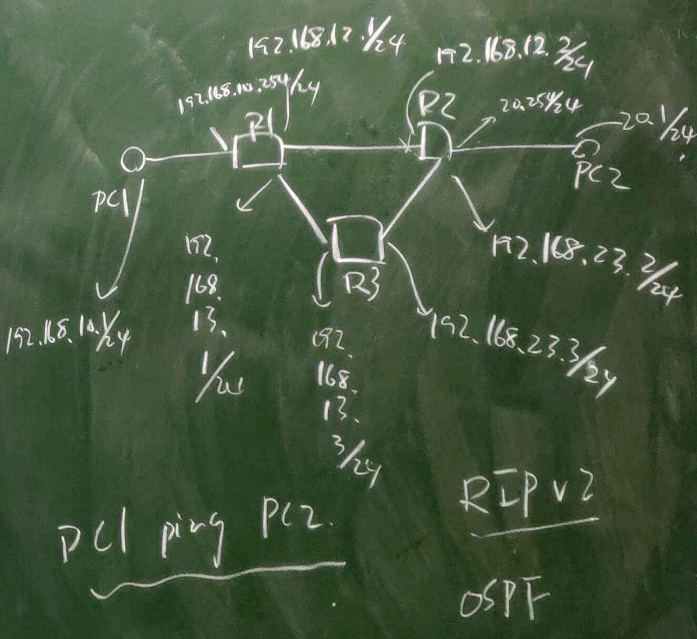
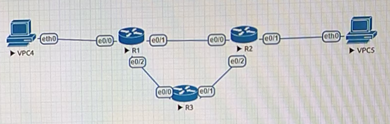
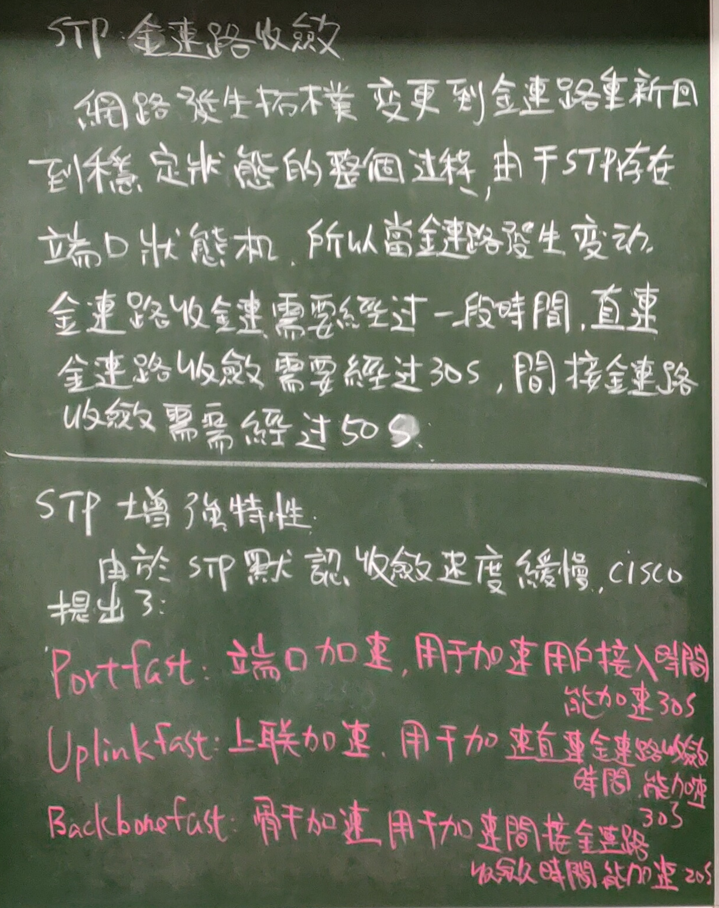
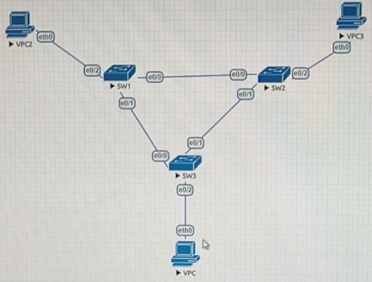
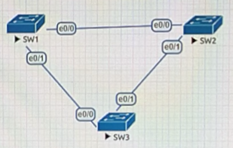
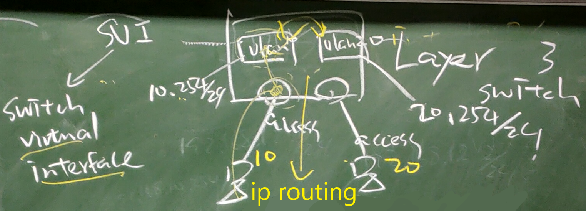
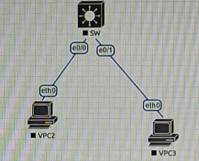
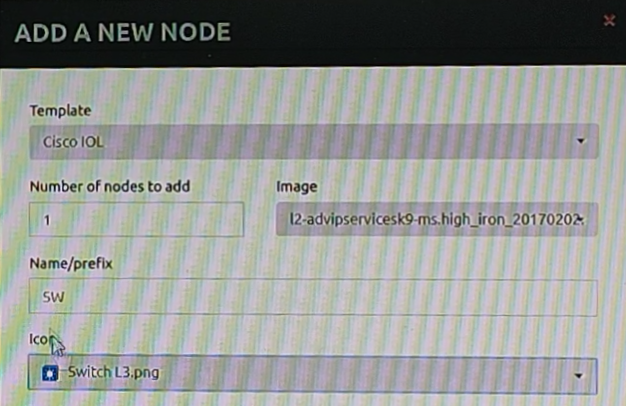

# 第十三周
## RIP與OSPF鏈路收斂實作          
        
         
### 好的路由協定(OSPF)與差的路由協定(RIP)做比較
```
//R1
>en
#conf t
#hostname R1
#int e0/0
#ip addr 192.168.10.254 255.255.255.0
#no shut
#int e0/1
#ip addr 192.168.12.1 255.255.255.0
#no shut
#int e0/2
#ip addr 192.168.13.1 255.255.255.0
#no shut
#do show ip int brief   //確認設定與狀態
#exit
//R2
>en
#conf t
#hostname R2
#int e0/0
#ip addr 192.168.12.2 255.255.255.0
#no shut
#int e0/1
#ip addr 192.168.20.254 255.255.255.0
#no shut
#int e0/2
#ip addr 192.168.23.2 255.255.255.0
#no shut
#do show ip int brief   //確認設定與狀態
//R3
>en
#conf t
#hostname R3
#int e0/0
#ip addr 192.168.13.3 255.255.255.0
#no shut
#int e0/1
#ip addr 192.168.23.3 255.255.255.0
#no shut
#do show ip int brief   //確認設定與狀態
//VPC4
>ip 192.168.10.1 255.255.255.0 192.168.10.254
>ping 192.168.10.254    //成功
//VPC5
>ip 192.168.20.1 255.255.255.0 192.168.20.254
>ping 192.168.20.254    //成功
```
### RIP收斂(約2分鐘)
```
//R1
#router rip
#version 2
#no auto-summary
#network 192.168.10.0
#network 192.168.12.0
#network 192.168.13.0
//R3
#router rip
#version 2
#no auto-summary
#network 192.168.13.0
#network 192.168.23.0
//R2
#router rip
#version 2
#no auto-summary
#network 192.168.12.0
#network 192.168.23.0
#network 192.168.20.0
#do show ip route       //檢查路由資訊
//VPC4
>trace 192.168.20.1     //列出封包路徑(192.168.10.254>192.168.12.2>192.168.20.1)
>ping 192.168.20.1 -t   //-t:一直執行
//R2
#int e0/0
#shut
//此時VPC4會ping不到VPC5(192.168.20.1)，過了約2分鐘，才會再ping到VPC5(192.168.20.1)
//VPC4
>trace 192.168.20.1     //封包路徑變了(192.168.10.254>192.168.13.3>192.168.23.3>192.168.20.1)
```
### OSPF收斂(約3秒鐘)
```
//R2
#no shut
#no router rip
//R3
#no router rip
//R1
#no router rip
#router ospf 1
#network 192.168.10.0 0.0.0.255 area 0
#network 192.168.12.0 0.0.0.255 area 0
#network 192.168.13.0 0.0.0.255 area 0
//R3
#router ospf 1
#network 192.168.13.0 0.0.0.255 area 0
#network 192.168.23.0 0.0.0.255 area 0
//R2
#router ospf 1
#network 192.168.20.0 0.0.0.255 area 0
#network 192.168.12.0 0.0.0.255 area 0
#network 192.168.23.0 0.0.0.255 area 0
#do show ip route       //檢查路由資訊
//VPC4
>trace 192.168.20.1     //列出封包路徑(192.168.10.254>192.168.12.2>192.168.20.1)
>ping 192.168.20.1 -t   
//R2
#int e0/0
#shut
//此時VPC4會ping不到VPC5(192.168.20.1)，過了約3秒鐘，才會再ping到VPC5(192.168.20.1)
//VPC4
>trace 192.168.20.1     //封包路徑變了(192.168.10.254>192.168.13.3>192.168.23.3>192.168.20.1)
```
## STP鏈路收斂(layer 2 switch)         
       
* STP端口狀態          
    1. Blocking(阻塞狀態)：執行阻塞端口。
    2. Listening(偵聽端口)：執行端口選舉。
    3. Learning(學習狀態)：執行地址學習。
    4. Forwarding(轉發狀態)：執行數據轉發。

         
* 鏈路收斂
    * 網路發生拓樸變更到鏈路重新回到穩定狀態的整個過程。
    * 由於STP存在端口狀態機，所以當鏈路發生變動鏈路收斂需要經過一段時間。
        1. 直連鏈路收斂需要經過30秒。
        2. 間接鏈路收斂需要經過50秒。   

### STP鏈路收斂與STP端口狀態實作
#### 初始端口狀態說明
         
```
//VPC
>ip 192.168.1.1 255.255.255.0
//VPC2
>ip 192.168.1.2 255.255.255.0
//VPC3
>ip 192.168.1.3 255.255.255.0
//SW1
>en
#conf t
#do show spanning-tree  //觀察端口狀態，有使用的端口皆為DP(指定端口)，發現SW1為root(端口狀態與機器類別請參考上週筆記)
//SW2
>en
#conf t
#do show spanning-tree  //觀察端口狀態，發現有使用的端口e0/0為RP(根端口)，其他都是DP(指定端口)
//SW3
>en
#conf t
#do show spanning-tree  //觀察端口狀態，發現有使用的端口e0/0為RP(根端口)，e0/1為BP(阻塞端口)，e0/2為DP(指定端口)
//可以比較Bridge ID(Priority+Address)來查看誰是ROOT(根橋)，此處Priority皆相同，所以看Address，發現SW1的最小(SW1為aabb.cc00.0100，SW2為aabb.cc00.0200，SW3為aabb.cc00.0300)，所以SW1為ROOT(根橋)。
//開啟Wireshark觀察SW3 e0/0,e0/1端口，看VPC傳封包到VPC3會往哪個端口
//VPC
>ping 192.168.1.3
//發現因為SW3 e0/1為BP(阻塞端口)，所以e0/0端口可以觀察到ICMP封包，而e0/1端口完全沒有觀察到ICMP封包。
```
#### STP鏈路收斂與端口狀態(直連/間接 鏈路收斂)
 * 斷在SW3 e0/0觀察收斂(直連)
```
//VPC
>ping 192.168.1.2 -t
//SW3
#int e0/0
#shut
//發現VPC傳封包到VPC2，途中斷線大約15秒
#do show spanning-tree  //發現原本e0/1為BP(阻塞端口)，現在變成DP(指定端口)，狀態為FWD(Forwarding)
#int e0/0
#no shut
#do show spanning-tree  //發現變回原本e0/1為BP(阻塞端口) blocking的狀態
```
 * 斷在SW1 e0/1觀察收斂(間接)
```
//VPC
>ping 192.168.1.2 -t    //這裡一開始可能ping不到，因為SW3 e0/0剛回復狀態，等15秒左右
//SW1
#int e0/1
#shut
//發現VPC傳封包到VPC2，途中斷線大約25秒
#no shut
```
 * 斷在SW2 e0/0觀察收斂(間接)
```
//VPC
>ping 192.168.1.3 -t    //這裡一開始可能ping不到，因為SW1 e0/1剛回復狀態，等25秒左右
//SW2
>en
#conf t
#int e0/0
#shut
//發現VPC傳封包到VPC3，途中斷線大約25秒
#no shut
```
* STP增強特性
    * 由於STP默認收斂速度緩慢，cisco提出以下模式：
        1. Portfast:端口加速，用於加速用戶接入時間，能加速30秒。
        2. Uplinkfast:上聯加速，用於加速直連鏈路收斂時間，能加速30秒。
        3. Backbonefast:骨幹加速，用於加速間接鏈路收斂時間，能加速20秒。   
   
```
//SW3
#exit
#int e0/2
#spanning-tree portfast     //會提示只能連終端機，不能連switch...
#exit
#spanning-tree uplinkfast
//SW1
#exit
#spanning-tree backbonefast 
//SW2
#exit
#spanning-tree backbonefast
//SW3
#exit
#debug spanning-tree events
#int e0/2
#shut
#do show spanning-tree  //會看到e0/2端口消失，處於blocking狀態
#no shut    //debug會自動顯示e0/2端口從blocking狀態變成forwarding狀態
#exit
#exit
#no debug all   //老師沒研究debug的用法，所以先關掉，換下個主題
```
## STP切換VLAN來做BP切換(解決BP所帶來的頻寬浪費問題)
         
```
//SW1
>en
#conf t
#vlan 10
#do show vlan   //確認是否建立vlan 10若沒有再下一次指令
#vlan 20
#do show vlan   //確認是否建立vlan 20若沒有再下一次指令
#exit
#spanning-tree vlan 10 root primary     //指定SW1為vlan 10的根橋
#spanning-tree vlan 20 root secondary   //指定SW1為vlan 20的次根橋
//SW2
>en
#conf t
#vlan 10
#do show vlan   //確認是否建立vlan 10若沒有再下一次指令
#vlan 20
#do show vlan   //確認是否建立vlan 20若沒有再下一次指令
#exit
#spanning-tree vlan 20 root primary     //指定SW2為vlan 20的根橋
#spanning-tree vlan 10 root secondary   //指定SW2為vlan 10的次根橋
//SW3
>en
#conf t
#vlan 10
#do show vlan   //確認是否建立vlan 10若沒有再下一次指令
#vlan 20
#do show vlan   //確認是否建立vlan 20若沒有再下一次指令
//SW1
#do show spanning-tree vlan 10  //發現如設定SW1為vlan 10的根橋
//SW2
#do show spanning-tree vlan 20  //發現如設定SW2為vlan 20的根橋
```
## Layer 3 switch(SVI接口設定)實作
         
         
         
> ### 此l2是有包含Layer 3的switch模擬      
```
//VPC2
>ip 192.168.10.1 255.255.255.0 192.168.10.254
//VPC3
>ip 192.168.20.1 255.255.255.0 192.168.20.254
//SW
>en
#conf t
#ip routing     //啟動路由功能
#vlan 10
#do show vlan   //確認是否建立vlan 10若沒有再下一次指令
#exit
#vlan 20
#int vlan 20
#do show vlan   //確認是否建立vlan 20若沒有再下一次指令
#int e0/0
#switchport mode access
#switchport access vlan 10
#int e0/1
#switchport mode access
#switchport access vlan 20
#int vlan10
#ip addr 192.168.10.254 255.255.255.0   //vlan 10配置成SVI接口
#no shut
#int vlan 20
#ip addr 192.168.20.254 255.255.255.0   //vlan 20配置成SVI接口
#no shut
#do show ip int brief
//VPC2
>ping 192.168.10.254    //成功
>ping 192.168.20.254    //成功
>ping 192.168.20.1      //成功
```