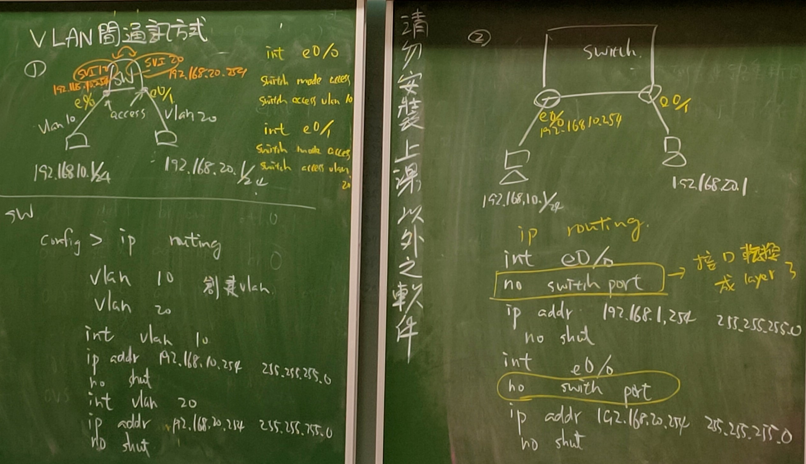
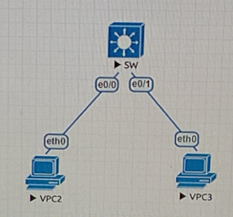
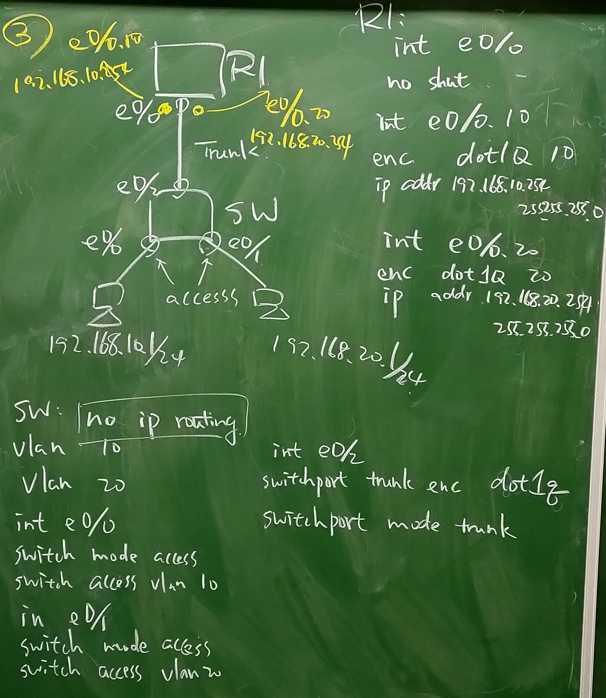
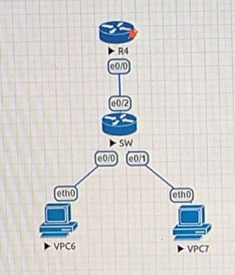
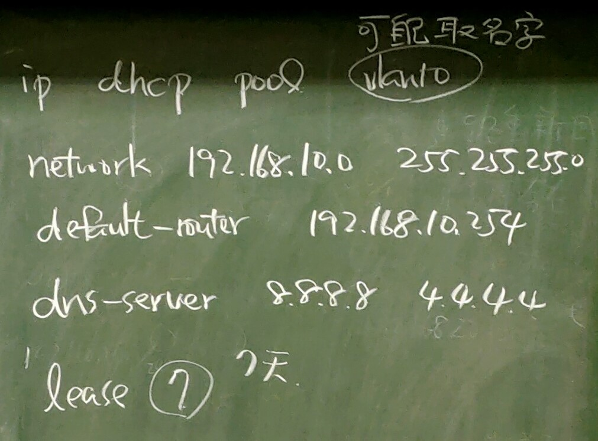
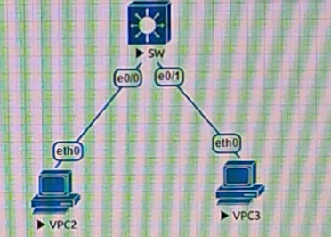
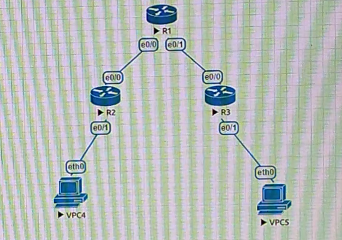
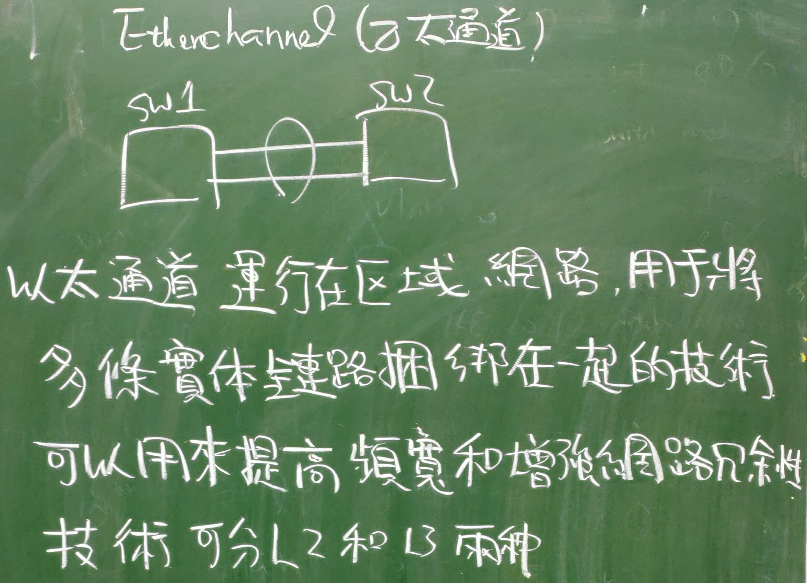
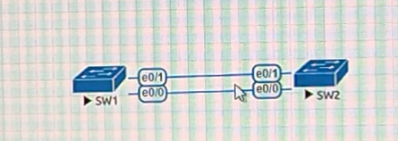

# 第十四週
## VLAN間通訊的三種方法    
             
             
       
1. Layer3 switch的SVI接口             
        
```
//VPC2
>ip 192.168.10.1 255.255.255.0 192.168.10.254
//VPC3
>ip 192.168.20.1 255.255.255.0 192.168.20.254
//SW
>en
#conf t
#ip routing     //啟動路由功能
#vlan 10
#do show vlan   //確認是否建立vlan 10若沒有再下一次指令
#exit
#vlan 20
#do show vlan   //確認是否建立vlan 20若沒有再下一次指令
#int e0/0
#switchport mode access
#switchport access vlan 10
#int e0/1
#switchport mode access
#switchport access vlan 20
#int vlan 10
#ip addr 192.168.10.254 255.255.255.0   //vlan 10配置成SVI接口
#no shut
#int vlan 20
#ip addr 192.168.20.254 255.255.255.0   //vlan 20配置成SVI接口
#no shut
#do show ip int brief
//VPC2
>ping 192.168.10.254    //成功
>ping 192.168.20.254    //成功
>ping 192.168.20.1      //成功
```
        
2. 透過跨交換機來做通訊         

```
//VPC2
>ip 192.168.10.1 255.255.255.0 192.168.10.254
//VPC3
>ip 192.168.20.1 255.255.255.0 192.168.20.254
//SW
>en
#conf t
#ip routing     //啟動路由功能
#int e0/0
#no switchport      //接口轉成Layer 3
#ip addr 192.168.10.254 255.255.255.0
#no shut
#int e0/1
#no switchport      //接口轉成Layer 3
#ip addr 192.168.20.254 255.255.255.0
#no shut
//VPC2
>ping 192.168.10.254    //成功
>ping 192.168.20.254    //成功
>ping 192.168.20.1      //成功
```
       
             
             
      
3. 單臂路由(先設VPC和Switch，再設Router)           
```
//VPC6
>ip 192.168.10.1 255.255.255.0 192.168.10.254
>show ip    //檢查是否設定成功
//VPC7
>ip 192.168.20.1 255.255.255.0 192.168.20.254
//SW
>en
#conf t
#vlan 10
#do show vlan   //確認是否建立vlan 10若沒有再下一次指令
#exit
#vlan 20
#do show vlan   //確認是否建立vlan 20若沒有再下一次指令
#int e0/0
#switchport mode access
#switchport access vlan 10
#int e0/1
#switchport mode access
#switchport access vlan 20
#int e0/2
#switchport trunk encapsulation dot1q
#switchport mode trunk
//R4
>en
#conf t
#int e0/0
#no shut
#int e0/0.10
#encapsulation dot1q 10     //trunk進來封裝vlan 10
#ip addr 192.168.10.254 255.255.255.0   //設定IP
#int e0/0.20
#encapsulation dot1q 20     //trunk進來封裝vlan 20
#ip addr 192.168.20.254 255.255.255.0   //設定IP
#do show ip int brief       //檢查e0/0,e0/0.10,e0/0.20這三個介面是否開啟，且e0/0.10 IP為192.168.10.254，e0/0.20 IP為192.168.20.254
//VPC6
>ping 192.168.10.254    //成功
>ping 192.168.20.254    //成功
>ping 192.168.20.1      //成功
```
     
## DHCP Server設定
             
             
```
//SW
>en
#conf t
#ip dhcp pool vlan10
#network 192.168.10.0 255.255.255.0
#default-router 192.168.10.254
#dns-server 8.8.8.8 4.4.4.4
#exit   //回全局模式
#ip dhcp excluded-address 192.168.10.250 192.168.10.255     //保留192.168.10.250至192.168.10.255的位置，不會拿去做DHCP的位置分配
#ip dhcp pool vlan20
#network 192.168.20.0 255.255.255.0
#default-router 192.168.20.254
#dns-server 8.8.8.8 4.4.4.4
#exit   //回全局模式
#ip dhcp excluded-address 192.168.20.250 192.168.20.255     //保留192.168.20.250至192.168.20.255的位置，不會拿去做DHCP的位置分配
//VPC2
>show ip    //檢查機子上是否有設過IP
>clear ip   //若有用此指令清除之前設置的IP
>show ip    //重新確認(IP/MASK 0.0.0.0/0,Gateway 0.0.0.0)
//開啟SW e0/0接口的wireshark，觀察dhcp處理過程的封包
>ip dhcp
//wireshark會觀察到dhcp四個封包Discover,Offer,Request,ACK，DHCP伺服器PORT為67，DHCP客戶PORT為68，還有Message type有兩種要求(1)與回覆(2)，Hardware type硬體類型為Ethernet(0x01)乙太網路，Hardware address length乙太網路使用的網路位置長度為6，Hops跳數為0等等資訊，觀察Discover,Offer,Request,ACK四個封包的不同，且DHCP客戶從IP為0.0.0.0變到有IP 192.168.10.1等等的封包設置
>show ip    //可以看到配好的IP和Gateway，DNS,DHCP Server為剛剛SW上的配置，配置為vlan 10的設置
//VPC3
>show ip    //檢查機子上是否有設過IP
>clear ip   //若有用此指令清除之前設置的IP
>show ip    //重新確認(IP/MASK 0.0.0.0/0,Gateway 0.0.0.0)
>ip dhcp
>show ip    //可以看到配好的IP和Gateway，DNS,DHCP Server為剛剛SW上的配置，配置為vlan 20的設置
>ping 192.168.10.1      //ping VPC2機子結果成功
```
>### dhcp封包用UDP通訊，會看到設置ip dhcp等待時出現DORA的字樣，分別是Discover,Offer,Request,Acknowledge，此四步驟皆為廣播傳送，Discover尋找區網內附近哪裡有DHCP伺服器，DHCP伺服器再回個Offer給DHCP客戶，裡面有給予的IP位置及遮罩等等資訊，DHCP客戶再跟DHCP伺服器回個Request，說要剛剛配的那些資訊，DHCP伺服器就會回覆好給DHCP客戶，然後保留配給客戶的資訊，此配置資訊就不會配給其他客戶了。有一點提醒，Request用廣播傳送，是因為DHCP伺服器可能不只一台，所以最先收到Offer的，Request就會表明要用最先到的那個配置，全部DHCP伺服器就會保留該Request的資訊。此Request回法可能有安全疑慮，因為找近的DHCP伺服器，所以可能是配到不安全的DHCP伺服器。
          
>## 然後老師說DHCP伺服器並不會放在Switch上，通常放在Router上，所以改成用剛剛的單臂路由重做一次，此為常識所以以後要多多注意不要犯錯。
             
```
//R4
>en
#conf t
#ip dhcp pool vlan10
#network 192.168.10.0 255.255.255.0
#default-router 192.168.10.254
#dns-server 8.8.8.8 4.4.4.4
#exit   //回全局模式
#ip dhcp excluded-address 192.168.10.250 192.168.10.255     //保留192.168.10.250至192.168.10.255的位置，不會拿去做DHCP的位置分配
#ip dhcp pool vlan20
#network 192.168.20.0 255.255.255.0
#default-router 192.168.20.254
#dns-server 8.8.8.8 4.4.4.4
#exit   //回全局模式
#ip dhcp excluded-address 192.168.20.250 192.168.20.255     //保留192.168.20.250至192.168.20.255的位置，不會拿去做DHCP的位置分配
//VPC6
>show ip    //檢查機子上是否有設過IP
>clear ip   //若有用此指令清除之前設置的IP
>show ip    //重新確認(IP/MASK 0.0.0.0/0,Gateway 0.0.0.0)
>ip dhcp
>show ip    //可以看到配好的IP和Gateway，DNS,DHCP Server為剛剛R4上的配置，配置為vlan 10的設置
//VPC7
>show ip    //檢查機子上是否有設過IP
>clear ip   //若有用此指令清除之前設置的IP
>show ip    //重新確認(IP/MASK 0.0.0.0/0,Gateway 0.0.0.0)
>ip dhcp
>show ip    //可以看到配好的IP和Gateway，DNS,DHCP Server為剛剛R4上的配置，配置為vlan 20的設置
//此時再外加一台VPC
//R4
>en
#conf t
#int e0/3
#switchport mode access
#switchport access vlan 20
//VPC8
>show ip    //檢查機子IP(IP/MASK 0.0.0.0/0,Gateway 0.0.0.0)
>ip dhcp    //可能會失敗，因為路由在重整剛剛設的接口介面，所以多試幾次
>show ip    //可以看到配好的IP和Gateway，DNS,DHCP Server為剛剛R4上的配置，配置為vlan 20的設置
//此時改R4 e0/3的vlan
//R4
#int e0/3
#switchport access vlan 10
//VPC8
>show ip    //檢查機子IP(IP/MASK 0.0.0.0/0,Gateway 0.0.0.0)
>clear ip
>ip dhcp    //可能會失敗，因為路由在重整剛剛設的接口介面，所以多試幾次
>show ip    //配置變為vlan 10的設置
//R4
#exit
#exit
#show ip dhcp pool  //可觀察到每個pool各自的IP address範圍與分配了幾個出去等等資訊
#show ip dhcp binding   //會顯示所有pool分配出去的位置、客戶ID等等資訊，會發現有四個，因為一個為VPC6 192.168.10.1，另一個為VPC7 192.168.20.1，最後VPC8有兩個192.168.10.2,192.168.20.2
//會發生此情形是因為DHCP給的租借時間lease time為預設7天，所以等七天後，DHCP伺服器才會全清掉紀錄，重新分配，怕會有DHCP客戶關掉又重開，又配新的位置給剛剛配過的客戶，這樣浪費了一個位置，若一直出現此情形會浪費許多位置，且要等7天才會重整，可能出現配不到位置的問題，所以盡量把lease time設的小一點，此問題通常出現在Wi-Fi上，所以基本上Wi-Fi lease time會設四小時
```
## DHCP Relay實作(R2,R3接收DHCP封包，並把DHCP封包指向R1這台DHCP Server，原本廣播(broadcast)的DHCP封包經過R2,R3變成單播(unicast)的DHCP封包傳給R1)
             
```
//R1(DHCP Server)
>en
#conf t
#int e0/0
#ip addr 192.168.12.1 255.255.255.0
#no shut
#int e0/1
#ip addr 192.168.13.1 255.255.255.0
#no shut
#do show ip int brief       //檢查設置是否正確
//R2
>en
#conf t
#int e0/0
#ip addr 192.168.12.2 255.255.255.0
#no shut
#int e0/1
#ip addr 192.168.10.254 255.255.255.0
#no shut
#do show ip int brief       //檢查設置是否正確
//R3
>en
#conf t
#int e0/0
#ip addr 192.168.13.3 255.255.255.0
#no shut
#int e0/1
#ip addr 192.168.20.254 255.255.255.0
#no shut
#do show ip int brief       //檢查設置是否正確
//R1(DHCP Server)
#exit
#ip dhcp pool mylan1
#network 192.168.10.0 255.255.255.0
#default-router 192.168.10.254
#dns-server 8.8.8.8
#exit
#ip dhcp pool mylan2
#network 192.168.20.0 255.255.255.0
#default-router 192.168.20.254
#dns-server 8.8.8.8
#exit
//R2(設置IP Helper)
#int e0/1
#ip helper-address 192.168.12.1     //做指向R1介面e0/0的位置
#do ping 192.168.12.1 source 192.168.10.254     //發現傳送失敗，所以表示回傳沒設定
//R3(設置IP Helper)
#int e0/1
#ip helper-address 192.168.13.1     //做指向R1介面e0/0的位置
#do ping 192.168.13.1 source 192.168.20.254     //發現傳送失敗，所以表示回傳沒設定
//R1(DHCP Server設定回傳)
#ip route 192.168.10.0 255.255.255.0 192.168.12.2   //設置靜態路由告知DHCP Server，192.168.10.0的封包回傳往192.168.12.2這位置送
#ip route 192.168.20.0 255.255.255.0 192.168.13.3   //設置靜態路由告知DHCP Server，192.168.20.0的封包回傳往192.168.13.3這位置送
//VPC4
>show ip    //檢查機子上是否有設過IP(IP/MASK 0.0.0.0/0,Gateway 0.0.0.0)
>ip dhcp    //可能會失敗，因為路由在重整設定，所以多試幾次
>show ip    //發現取到IP
//VPC5
>show ip    //檢查機子上是否有設過IP(IP/MASK 0.0.0.0/0,Gateway 0.0.0.0)
>ip dhcp    //可能會失敗，因為路由在重整設定，所以多試幾次
>show ip    //發現取到IP
```
## Etherchannel(乙太通道，讓交換機之間通訊頻寬加倍，也可當備用鏈路用，最多可設8條鏈路，8條傳速要一樣才能合併)
             
             

1. Layer 2

```
//SW1
>en
#conf t
#int range e0/0-1
#switchport trunk encapsulation dot1q
#switchport mode trunk
#channel-group 1 mode on
//會顯示虛擬的interface Port-channel 1創建
//SW2
>en
#conf t
#int range e0/0-1
#switchport trunk encapsulation dot1q
#switchport mode trunk
#channel-group 1 mode on
//會顯示虛擬的interface Port-channel 1創建
//SW1
#do show etherchannel summary       //查看設置資訊，可看到剛剛的設置
#do show int e0/0     //查看屬性，頻寬為10000 Kbit/sec
#do show int port-channel 1     //查看屬性，可看到頻寬加倍了
```

2. Layer 3

```
//SW1
>en
#conf t
#int range e0/0-1
#no switchport      //接口轉成Layer 3
#channel-group 12 mode on
//會顯示虛擬的interface Port-channel 12創建
//SW2
>en
#conf t
#int range e0/0-1
#no switchport      //接口轉成Layer 3
#channel-group 12 mode on
//會顯示虛擬的interface Port-channel 12創建
//SW1
#int port-channel 12
#ip addr 192.168.12.1 255.255.255.0
//SW2
#int port-channel 12
#ip addr 192.168.12.2 255.255.255.0
//SW1
#do show etherchannel summary       //查看設置資訊，可看到剛剛的設置
#do show int e0/0     //查看屬性，頻寬為10000 Kbit/sec
#do show int port-channel 12     //查看屬性，可看到頻寬加倍了
```