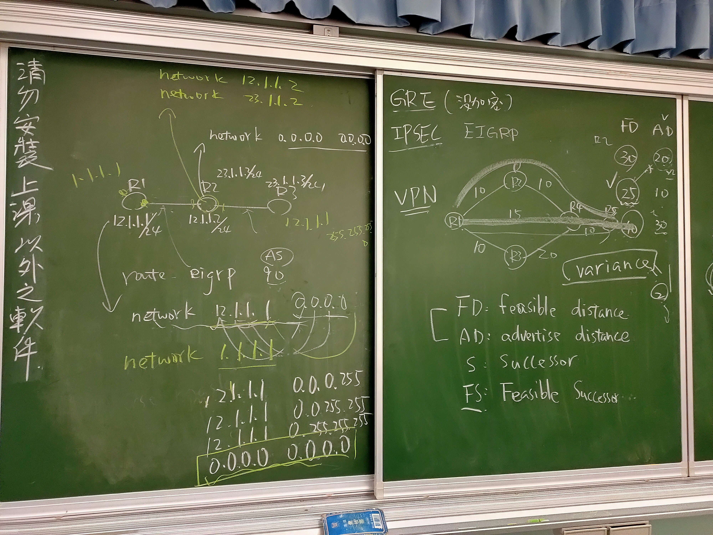
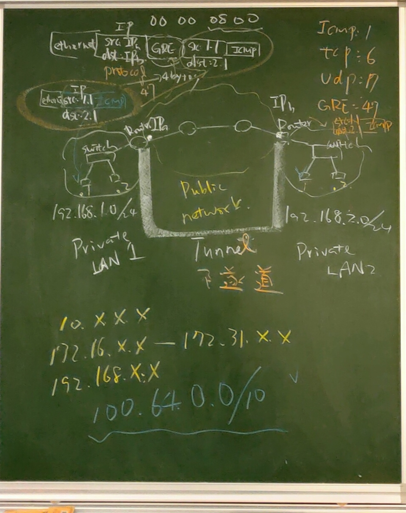
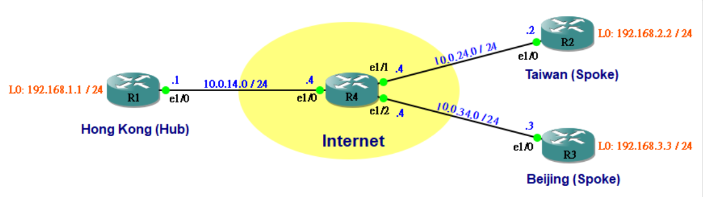

# 第七周
## 路由分類說明
### 靜態路由（Static Route）    
由管理人員手動輸入，速度很快，不須經過學習，缺點是網路拓樸有任何的改變，管理人員須更新資料到路由器設備中，較麻煩且耗人力，必須具備很好的維護能力。這種比較適合幾乎不會變動的網路拓樸。       
### 動態路由（Dynamic Route）      
不須手動輸入，一切的工作交給路由器設備之間去協調，互相交換並學習資料，管理人員只要做Routing Protocol設定即可。這種較耗費系統資源，速度稍微慢一點，因系統需要時間做學習的動作，也需要時間才能把Routing Table建立得較完整。好處是一旦網路架構有任何的改變，網管人員不須做太多事情來管理並維護Routing Table。        
有分自治區內的連線(IGP，Interior Gateway Protoco)與自治區與自治區的連線(EGP，Exterior Gateway Protocol)。       
IGP：        
 1. RIP：更新時間30秒          
 2. EIGRP：CISCO自訂協定          
 3. OSPF        
 4. ISIS：大型網路用，可運行五萬筆路由左右。                 
        
EGP：          
 1. BGP(Border Gateway Protocol)                        
         
           

## EIGRP重點說明             
優點：        
 1. 不須把整個路由表廣播給其他路由器。     
 2. ECMP等價多路徑路由(Equal-cost multi-path)做故障容許度 (Fault tolerance)用，非ECMP做Load balance用。              

品質評估有六個值，通常只看1~5KEY(1~5K)，bandwidt,delay,reliability,MTU,load。        
有鄰居拓樸路由(neighbor topology routing)，cef為cisco express forwarding(做Load balance要關的)。          
            
圖右有個網路拓樸有個FD,AD表，其中Successor為最小的25，FS為AD小於FD的20，Successor為best path，FS當作備用的Successor，當Successor出問題時，EIGRP會立刻啟用FS頂替。      
圖左為network設定時會用0.0.0.0做通路設定，此為簡易的方法設定，還有反掩碼的設定形式。        
## GRE重點與設定(手動建置)       
接著說明各個私網路之間做連線的方法Tunnel。           
             
通常私有網域IP形式為10.x.x.x,172.16.x.x,192.168.x.x,100.64.0.0/10。        
在使用Tunnel的GRE封包如圖最上方的格式。        
         
建立上圖網路，並做R2toR1,R1toR3,R3toR2的三個tunnel。
```
//R1
>en
#conf t
#hostname R1
#int lo1
#ip addr 192.168.1.1 255.255.255.0
#no shut
#int e0/0
#ip addr 10.0.14.0 255.255.255.0
#no shut
//R4
>en
#conf t
#hostname R4
#int e0/0
#ip addr 10.0.14.4 255.255.255.0
#no shut
#int e0/1
#ip addr 10.0.24.4 255.255.255.0
#no shut
#int e0/2
#ip addr 10.0.34.3 255.255.255.0
#no shut
//R2
>en
#conf t
#hostname R2
#int lo 0
#ip addr 192.168.2.2 255.255.255.0
#no shut
#int e0/0
#ip addr 10.0.24.2 255.255.255.0
#no shut
//R1
#do ping 10.0.14.4 //成功
#do ping 10.0.24.4 //失敗，因IP Route裡沒有此網域。
#exit
#ip route 0.0.0.0 0.0.0.0 10.0.14.4
#do ping 10.0.24.4 //成功
#do ping 10.0.24.2 //失敗，因R2沒回傳
//R2
#exit
#ip route 0.0.0.0 0.0.0.0 10.0.24.4
//R1
#do ping 10.0.24.2 //成功
#do ping 192.168.2.2 source 192.168.1.1 //失敗，因不同內網不能連線。
#int tunnel 12
#ip addr 172.16.12.1 255.255.255.0
#do show ip int brief  //可以看到新建Tunnel
#tunnel source 10.0.14.1
#tunnel destination 10.0.24.2
//R2
#int tunnel 12
#ip addr 172.16.12.2 255.255.255.0
#tunnel source 10.0.24.2
#tunnel destination 10.0.14.1
//R1
#do ping 172.16.12.2 source 172.16.12.1 //成功
#ip route 192.168.2.0 255.255.255.0 172.16.12.2
//R2
#exit
#ip route 192.168.1.0 255.255.255.0 172.16.12.1
//R1
#ip route 192.168.2.0 255.255.255.0 172.16.12.2
#do ping 192.168.2.2 source 192.168.1.1 //成功
#do show ip route       //會看到192.168.2.0的靜態路由，R2也有192.168.1.0的。
//再開Wireshark觀察到GRE封包，封包最外層為隧道的來源端到目的端。
//R3
>en
#conf t
#hostname R3
#int lo 0
#ip addr 192.168.3.3 255.255.255.0
#no shut
#int e0/0
#ip addr 10.0.34.3 255.255.255.0
#no shut
//R1
#int tunnel 13
#ip addr 172.16.13.1 255.255.255.0
#tunnel source 10.0.14.1
#tunnel destination 10.0.34.3
#ip route 192.168.3.0 255.255.255.0 172.16.13.3
//R3
#int tunnel 13
#ip addr 172.16.13.3 255.255.255.0
#tunnel source 10.0.34.3
#tunnel destination 10.0.14.1
#ip route 192.168.1.0 255.255.255.0 172.16.13.1
#do ping 192.168.1.1 source 192.168.3.3 //成功
//R2
#ip route 192.168.3.0 255.255.255.0 172.16.12.1
#ip route 172.16.13.0 255.255.255.0 172.16.12.1
//R3
#ip route 192.168.2.0 255.255.255.0 172.16.13.1
#ip route 172.16.12.0 255.255.255.0 172.16.13.1
#do ping 192.168.2.2 source 192.168.3.3 //成功
```
## 清除路由表     
```
>en
#clear ip route *   //只清動態路由協定。
#show ip route      //發現手工建的靜態路由沒刪掉。
#show runn
//找到ip route 192.168.3.0 255.255.255.0 172.16.13.3。
#conf t
//反白ip route 192.168.3.0 255.255.255.0 172.16.13.3，在no後方按右鍵，就貼上了。
#no ip route 192.168.3.0 255.255.255.0 172.16.13.3      //這樣就清除靜態路由。
#show ip route      //發現手工建的靜態路由刪掉。
```
## 用RIP做各個私網路之間連線(自動建置)        
```
//R1
#router rip
#version 2
#no auto-summary
#network 172.16.12.1
#network 172.16.13.1
#network 192.168.1.1
//R2
#router rip
#version 2
#no auto-summary
#network 172.16.12.2
#network 192.168.2.2
//R3
#router rip
#version 2
#no auto-summary
#network 172.16.13.3
#network 192.168.3.3
#do show ip route       //查看其實與GRE做的設定差不多。
#do ping 192.168.2.2 source 192.168.3.3 //成功
```
> ## 也可以用EIGRP做自動建置，參考[Jan ho的網路世界](https://www.jannet.hk/zh-Hant/post/generic-routing-encapsulation-gre/)，OSPF也是做得到自動建置。