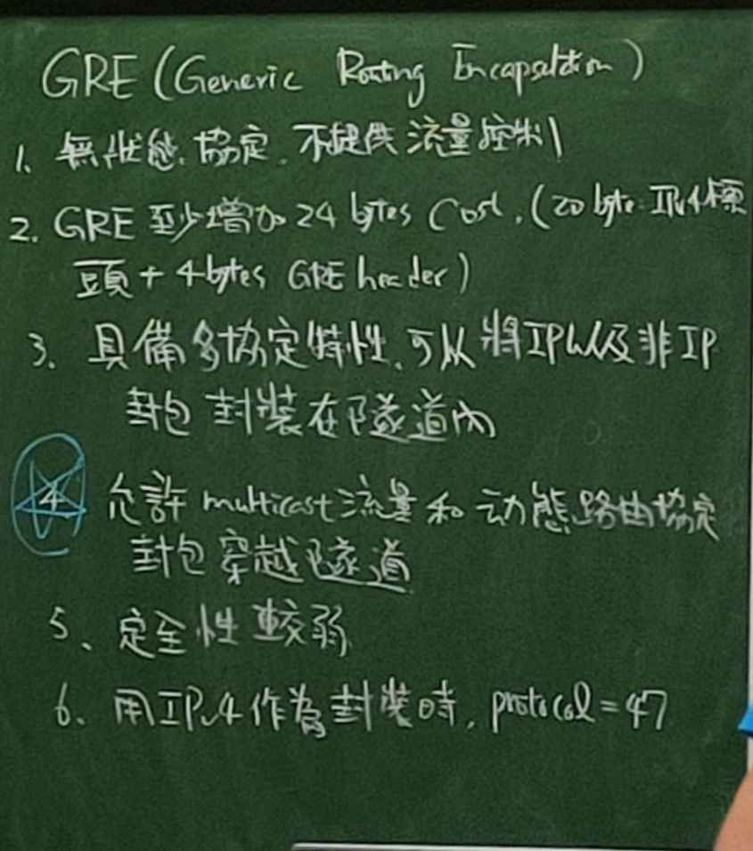
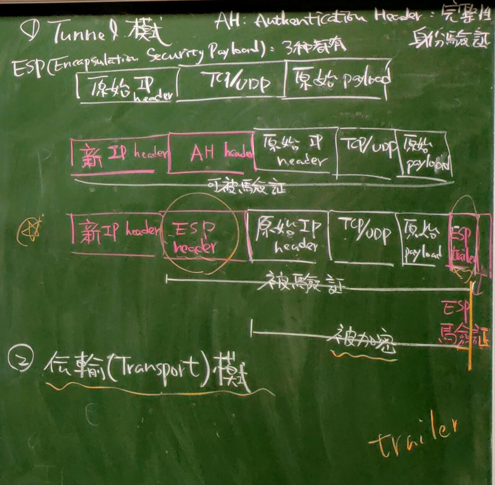
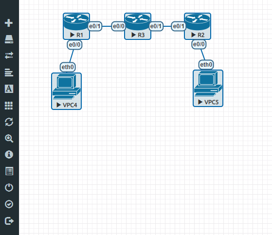
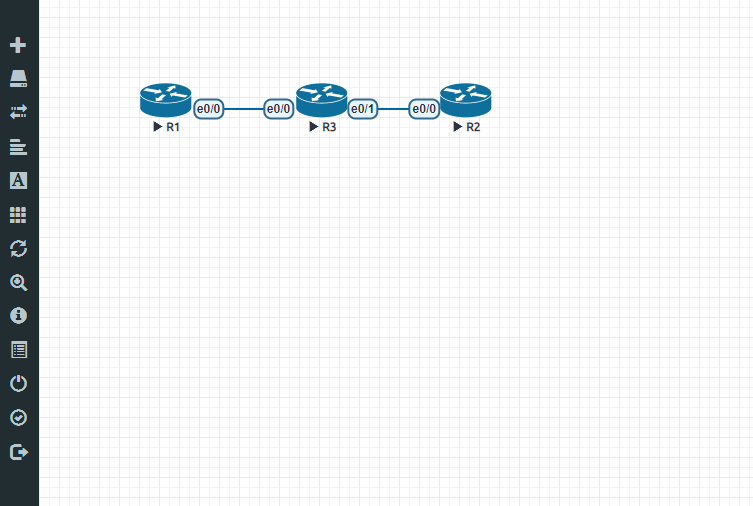

# 第八周       
## GRE(Generic Routing Encapsulation)               
                   
 1. 無狀態協定，不提供流量控制。         
 2. GRE至少增加24 bytes Cost(20 bytes:IPv4標頭+4 bytes GRE header)。           
 3. 具備多協定特性，可以將IP以及非IP封包，封裝在隧道(tunnel)內。           
 4. 允許multicast流量和動態路由協定封包穿越隧道。          
 5. 安全性較弱。             
 6. 用IPv4作為封裝時，protocol=47。         
## IPSEC(Internet Protocol Security)       
                   
- 概述：          
1. 數據機密性：常用加密演算法(DES,3DES,AES)                    
2. 數據完整性：常用演算法(MDS,SHA-1)。            
3. 身份驗證：常用方法pre-share預共享密碼和數字證書。            
4. 防重放攻擊(replay attack)：IPSec 接收方可檢測並拒絕接收過時或重複的封包。         
- 步驟：          
1. 建立一個安全通道，確保**密鑰(key)**能安全建立。            
2. 在步驟1建立的安全通道之上，提供安全的**資料(data)**傳輸。          
 > 步驟1與步驟2可以使用不同的加密演算法，如步驟1用DES，步驟2用AES。但一般都用相同的加密演算法。         
### IPSEC封包形式         
                   
                   
### IPSEC實作設定，參考:[Jan Ho的網路世界](https://www.jannet.hk/zh-Hant/post/internet-protocol-security-ipsec/)        
先在EVE-NG建三台路由(R1,R2,R3)，兩台電腦(P1,P2)，模擬私網內P1經由R1到R2(Internet)，再經由R2到R3，連到另一私網的P2。              
                   
```
//R1
>en
#conf t
#hostname R1
#int e0/0
#ip addr 192.168.10.1 255.255.255.0
#no shut
#int e0/1
#ip addr 192.168.13.1 255.255.255.0
#no shut
#exit
#ip route 0.0.0.0 0.0.0.0 192.168.13.3
//R2
>en
#conf t
#hostname R2
#int e0/0
#ip addr 192.168.20.1 255.255.255.0
#no shut
#int e0/1
#ip addr 192.168.23.2 255.255.255.0
#no shut
#exit
#ip route 0.0.0.0 0.0.0.0 192.168.23.3
//R3
>en
#conf t
#hostname R3
#int e0/0
#ip addr 192.168.13.3 255.255.255.0
#no shut
#int e0/1
#ip addr 192.168.23.3 255.255.255.0
#no shut
//R1
#do ping 192.168.23.2   //成功
#ip access-list extended VPN-Traffic
#permit ip 192.168.10.0 0.0.0.255 192.168.20.0 0.0.0.255    //此處掩碼為反掩碼
#exit
//R2
#ip access-list extended VPN-Traffic
#permit ip 192.168.20.0 0.0.0.255 192.168.10.0 0.0.0.255    //此處掩碼為反掩碼
#exit
//R1
#crypto isakmp policy 1
#encryption aes
#hash md5
#authentication pre-share
#group 2
//R2
#crypto isakmp policy 1
#encryption aes
#hash md5
#authentication pre-share
#group 2
//R1
#exit
#crypto ipsec transform-set TS esp-3des ah-sha-hmac
#exit
#crypto isakmp key 6 cisco address 192.168.23.2
//R2
#exit
#crypto ipsec transform-set TS esp-3des ah-sha-hmac
#exit
#crypto isakmp key 6 cisco address 192.168.13.1
//R1
#crypto map CMAP 1 ipsec-isakmp
#set peer 192.168.23.2
#set transform-set TS
#match address VPN-Traffic
#exit
#int e0/1
#crypto map CMAP
//R2
#crypto map CMAP 1 ipsec-isakmp
#set peer 192.168.13.1
#set transform-set TS
#match address VPN-Traffic
#exit
#int e0/1
#crypto map CMAP
```           
> 如果有設定錯誤可以用show run查看設定，並做修改。          
## GRE over IPSec            
先在EVE-NG建三台路由(R1,R2,R3)。                
                   
```
//R1
>en
#conf t
#hostname R1
#int lo0
#ip addr 1.1.1.1 255.255.255.0
#int e0/0
#ip addr 192.168.13.1 255.255.255.0
#no shut
#exit
#ip route 0.0.0.0 0.0.0.0 192.168.13.3
//R2
>en
#conf t
#hostname R2
#int lo0
#ip addr 2.2.2.2 255.255.255.0
#int e0/0
#ip addr 192.168.23.2 255.255.255.0
#no shut
#exit
#ip route 192.168.13.0 255.255.255.0 192.168.23.2
#ip route 192.168.13.0 255.255.255.0 192.168.23.3
//R1
#no ip route 0.0.0.0 0.0.0.0 192.168.13.3
#ip route 192.168.23.0 255.255.255.0 192.168.13.3
//R3
>en
#conf t
#hostname R3
#int e0/0
#ip addr 192.168.13.3 255.255.255.0
#no shut
#int e0/1
#ip addr 192.168.23.3 255.255.255.0
#no shut
//R1
#do ping 192.168.13.3   //成功
#do ping 192.168.23.2   //成功
#ip access-list extended ipsec_tunnel
#permit ip host 192.168.13.1 host 192.168.23.2
//R2
#exit
#ip access-list extended ipsec_tunnel
#permit ip host 192.168.23.2 host 192.168.13.1
//R1
#exit
#crypto isakmp key ccie address 192.168.23.2
#crypto isakmp policy 10
#encryption aes
#authentication pre-share
#group 2
#exit
#crypto ipsec transform-set TS esp-3des
#exit
#crypto map GRE_OVER_IPSEC 10 ipsec-isakmp
#set peer 192.168.23.2
#set transform-set TS
#match address ipsec_tunnel
#exit
#do show run    //檢查設定
//R2
#exit
#crypto isakmp key ccie address 192.168.13.1
#crypto isakmp policy 10
#encryption aes
#authentication pre-share
#group 2
#exit
#crypto ipsec transform-set TS esp-3des
#exit
#crypto map GRE_OVER_IPSEC 10 ipsec-isakmp
#set peer 192.168.13.1
#set transform-set TS
#match address ipsec_tunnel
#exit
#do show run    //檢查設定
#int e0/0
#crypto map GRE_OVER_IPSEC
//R1
#int e0/0
#crypto map GRE_OVER_IPSEC
#int tunnel 0
#ip address 172.16.12.1 255.255.255.0
#tunnel source enthernet 0/0
#tunnel destination 192.168.23.2
//R2
#int tunnel 0
#ip address 172.16.12.2 255.255.255.0
#tunnel source enthernet 0/0
#tunnel destination 192.168.13.1
#exit
//R1
#exit
#do ping 172.16.12.2 source 172.16.12.1   //成功
#router rip
#version 2
#no auto-summary
#network 172.16.12.1
#network 1.1.1.1
//R2
#router rip
#version 2
#no auto-summary
#network 172.16.12.2
#network 2.2.2.2
#exit
#do show ip route   //檢查設定
//R1
#exit
#do show ip route   //檢查設定
#do ping 2.2.2.2 source 1.1.1.1   //成功
```    
開啟R3 e0/0 wireshark觀察封包，在R1#do ping 2.2.2.2 source 1.1.1.1，觀察到IPSec的封包，而Security Payload中，看不到任何訊息，因為有做加密保護。          
