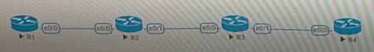

# 第九周   
## OSPF(open shortest path first)   

1. 版本:     
   - OSPFv2:IPv4   
   - OSPFv3:IPv6   
2. 動態路由   
3. IGP(Interior Gateway Protocols)(RIP,OSPF,EIGRP,ISIS)   
4. 支持VLSM(超網化)和CIDR(子網路切割)    
5. Link State    
6. 每30分鐘更新一次，AD為110，protocol number為89(補充RIP AD 120,EIGRP AD 90,EIGRPprotocol number為88)   
7. 會建三表   
    - neighbors表   
    - LSDB表   
    - 路由表    
8. 封包樣式就IP接OSPF。
## Link State(LS))說明及補充
   
1. distance vector(DV)：自己只知道旁邊node，兩兩交換資訊得到路由資訊。
2. LSA(link state advertisement)：flood到整個網路，所以網路中每個node都有相同的LSDB，透過此LSDB建構shortest path tree(SPT)，以得到從自己到不同node的最短路徑。(參考：[深度剖析OSPF協議](https://kknews.cc/code/gprllrm.html))    
    - 狀態1:router LSA
    - 狀態2:network LSA
    - 狀態3:ABR LSA
    - 狀態4:自治系統邊界路由器（ ASBR）發送的，用於向OSPF區域宣告自己的存在
    - 狀態5:自治系統邊界路由器（ASBR）發送的，用於向OSPF區域宣告「外部網絡」，即非OSPF區域的網絡信息。
    - 狀態7:和LSA5類似，也是由ASBR發送的，也是宣告非OSPF區域的網絡信息，是非絕對末梢區域（nssa）特有的鏈路通告，這個後面講解。
3. priority
4. router id   
    - 手動設定
    - loopback
    - up實體介面IP
## OSPF封包類型

1. hello
2. DBD(database description)
3. LSR(Link state request)
4. LSU(Link state update)送LSA
5. LSA(Link state ack)
## OSPF運作架構

1. point to point
2. point to multi point
3. Muti Access,MA(Broadcast)
4. NBMA(not broadcast multi access)
### 運作機器功能
1. ABR(邊界路由器，area border router)：為連接骨幹區(area0)和非骨幹區(area1...n)區域的路由器。
2. ASBR(自治系统邊界路由器，Autonomous System Boundary Router)，連接一個自治區骨幹並與另一個自治區骨幹區域的路由器。
3. 骨幹區(area0)和非骨幹區(area1...n)內都有三個路由角色    
    - DR(委任路由器，Designated Router)，只會有一個，選定後不會再更改，選擇方式手動設定優先，再來看IP小的優先。
    - BDR(備用委任路由器，Backup Designated Router)，只會有一個，當DR掛了頂替。
    - DRother
4. DRother用LSA狀態1(router LSA)傳訊息給DR，封包李IP為224.0.0.6
5. DR用LSA狀態2(network LSA)傳訊息給DRother，封包李IP為224.0.0.5
6. 建路由表時DR傳訊息給DRother，每個DRother再把自己的路由表給DR，DR建完LSDB後，把規畫好的路由表再傳給每個有LSR(Link state request)的DRother，所以現在每台node的路由表都和DR一樣。
## 實作

```
//R1
>en
#conf t
#hostname R1
#int e0/0
#ip addr 12.1.1.1 255.255.255.0
#no shut
//R2
>en
#conf t
#hostname R2
#int e0/0
#ip addr 12.1.1.2 255.255.255.0
#no shut
#int e0/1
#ip addr 23.1.1.2 255.255.255.0
#no shut
//R3
>en
#conf t
#hostname R3
#int e0/0
#ip addr 23.1.1.3 255.255.255.0
#no shut
//R1
#exit
#do show ip route
#do ping 12.1.1.2   //成功
#do ping 23.1.1.2   //失敗
#router ospf 1
#network 12.1.1.0 0.0.0.255 area 0
//R2
#exit
#router ospf 1
#network 12.1.1.0 0.0.0.255 area 0
#network 23.1.1.0 0.0.0.255 area 0
//R3
#exit
#router ospf 1
#network 23.1.1.0 0.0.0.255 area 0
//R1
#exit
#exit
#show ip ospf neighbor     //觀察鄰居有哪些
#show ip ospf interface    //觀察OSPF的狀態
#show interface e0/0       //觀察OSPF的狀態
#show ip route      //觀察OSPF的狀態
#show ip ospf database  //可以觀察到全路由的路由表
//R2
>en 
#show ip ospf database  //可以觀察到路由表和R1是一樣的
//R1
#do ping 23.1.1.2   //成功
```

```
//先重製
//R3
>en
#conf t
#no router ospf 1
//R2
>en
#conf t
#no router ospf 1
//R1
>en
#conf t
#no router ospf 1
#router ospf 1
#router-id 1.1.1.1
#network 12.1.1.0 0.0.0.255 a 0 //a 0 == area 0
//R2
#router ospf 1
#network 12.1.1.0 0.0.0.255 a 0
#network 23.1.1.0 0.0.0.255 a 0
//R1
#do show ip ospf neighbor
#do show ip ospf interface
//R2
#exit
#exit
#show ip ospf neighbor
#show ip ospf interface
#conf t
#no router ospf 1
//R1
#exit
#no router ospf 1
#int lo0
#ip addr 1.1.1.1 255.255.255.0
#do show ip int brief
//R2
#int lo 0
#ip addr 2.2.2.2 255.255.255.0
//R3
#int lo 0
#ip addr 3.3.3.3 255.255.255.0
#int e0/1
#ip addr 34.1.1.3 255.255.255.0
#no shut
#do show ip int brief
//R4
>en
#conf t
#hostname R4
#int e0/0
#ip addr 34.1.1.4 255.255.255.0
#no shut
#int lo 0
#ip addr 4.4.4.4 255.255.255.0
//R1
#router ospf 1
#network 12.1.1.0 0.0.0.255 a 1
#network 1.1.1.0 0.0.0.255 a 1
//R2
#router ospf 1
#network 12.1.1.0 0.0.0.255 a 1
#network 34.1.1.0 0.0.0.255 a 0
#network 2.2.2.0 0.0.0.255 a 0
//R3
#router ospf 1
#network 23.1.1.0 0.0.0.255 a 0
#network 3.3.3.0 0.0.0.255 a 0
#network 34.1.1.0 0.0.0.255 a 2
//R4
#router ospf 1
#network 34.1.1.0 0.0.0.255 a 2
#network 4.4.4.0 0.0.0.255 a 2
//R1
#exit
#exit
#show ip route
//R2
#exit
#exit
#show ip route
//R3
#exit
#exit
#show ip route
//R4
#exit
#exit
#show ip route
//R2
#show run | sec ospf    //發現network 34.1.1.0 0.0.0.255 a 0打錯
#conf t
#router ospf 1
#no network 34.1.1.0 0.0.0.255 a 0
#network 23.1.1.0 0.0.0.255 a 0
#do show ip route ospf 
//R1
#ping 4.4.4.4 source 1.1.1.1    //成功
```
## 合併子網路
```
//R1
#conf t
#int lo 2
#ip addr 172.16.8.1 255.255.255.0
#int lo 3
#ip addr 172.16.9.1 255.255.255.0
#int lo 4
#ip addr 172.16.10.1 255.255.255.0
#int lo 5
#ip addr 172.16.11.1 255.255.255.0
//R2
#exit
#do show ip route
#router ospf 1
#network 172.16.8.0 0.0.0.255 a 1
#network 172.16.9.0 0.0.0.255 a 1
#network 172.16.10.0 0.0.0.255 a 1
#network 172.16.11.0 0.0.0.255 a 1
#area 1 range 172.16.8.0 255.255.252.0      //只有在R2 run會出現
#do show run | sec ospf     //有area 1 range 172.16.8.0 255.255.252.0
//R1
#do show run | sec ospf     //沒有area 1 range 172.16.8.0 255.255.252.0
//R3
>en
#conf t
#do clear ip route * 
#do show ip route   //原本沒合併，在R2加area 1 range 172.16.8.0 255.255.252.0，就合併了
```